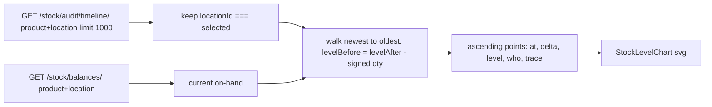

# Warehouse stock level chart (Unit 2 / Unit 11)

Frontend only. No backend change: `audit_event_dict` in [stock_ledger/views.py](stock_ledger/views.py) already returns `location_id`, `counterparty_location_id`, `at`, `quantity`, `lan_username`, `trace_number`, and the API already excludes QUEUED/CANCELLED postings, so the chart shows posted stock only.

## Two facts that drive the maths

1. Ledger quantity is signed. `services.issue`, `disposal`, `transfer` (out leg) and `production_consumption` all insert `quantity=-quantity`, and `_project_balance` does `balance.quantity + entry.quantity`. So `delta = Number(row.quantity)` directly. The current `Math.abs(...)` plus entry-type guessing in `visualStats` is dropped, which also fixes `count_adjustment` (signed delta, can go either way).
2. `location_id` on `/stock/audit/timeline/` is an OR against the counterparty:

```1902:1906:stock_ledger/views.py
        if location_id not in (None, ''):
            lid = int(location_id)
            qs = qs.filter(
                models.Q(location_id=lid) | models.Q(counterparty_location_id=lid)
            )
```

So rows must be filtered client-side to `row.locationId === selectedLocationId`, otherwise the transfer_in leg at Mixers (counterparty Unit 2) leaks in and doubles the movement.

## Series is anchored to today's on-hand, walked backwards

Forward-summing from zero is wrong the moment the 1000-row cap truncates history. Instead anchor on the balance and walk back:

- `current` = sum of `qtyToKg(onHandQty, unitName)` from `fetchBalances({ productId, locationId })`
- newest row: `levelAfter = current`; then `levelBefore = levelAfter - delta`, feeding the next older row
- reverse into ascending order, prepend a baseline point at the oldest row's time (`levelBefore`), append a "now" point holding the last level flat

Result: the line always ends exactly on the balance shown in the Balances tab.



## Files

### `src/features/stock/types.ts`
Add to `StockAuditTimelineRow`: `locationId: number | null`, `counterpartyLocationId: number | null`.

### `src/features/stock/api/stockMappers.ts`
In `mapAuditTimelineRow`, map `location_id` / `counterparty_location_id` via `toOptionalNumber`.

### `src/pages/product/StockLevelChart.tsx` (new)
Hand-rolled SVG (no chart lib is installed; deps are React Flow, dagre, ag-grid only). Props: `points`, `unitLabel = 'KG'`, `locationName`.

- x is real time, domain = first movement to now, so idle gaps read like a flat crypto line
- stepped path: flat run at the held level, vertical jump at each movement. Each jump plus the run after it is one path, stroked `#00703c` when `delta > 0` and `#d4351c` when `delta < 0`
- left axis: 4 gridlines with KG labels, `0` at the base; right edge carries a filled current-level tag
- bottom axis: 4 date ticks, `dd MMM`, adding `HH:mm` when the whole range is under 48h
- each movement gets a `<circle>` with a `<title>` (free native tooltip) and `onMouseEnter` setting a hovered index
- caption under the chart shows the hovered point via `formatStockDateTime(at)`, `movementTypeLabel(action)`, signed qty, resulting level, `formatWho`, trace; falls back to the latest movement when nothing is hovered

### `src/pages/product/ProductStockPanel.tsx`
- state: replace `visualTrace` with `visualLocationId: string`; keep `visualTimeline`, replace `visualRemaining` with a `visualOnHand: number`
- warehouse options from the existing `containers` list filtered by `isWarehouseLocation` (keeps the helper), default to Unit 2 when present
- `loadVisuals` becomes: `Promise.all([fetchBalances({ productId, locationId }), fetchStockAuditTimeline({ productId, locationId, limit: 1000 })])`, no lot lookup
- replace `visualStats` with a `levelSeries` memo implementing the backwards walk above
- render: warehouse toggle plus Refresh in the existing `managers-actions` header, then `<StockLevelChart>`, then a hint that queued picks are not counted until posted
- delete `QtyBar`, `RemainingSparkline`, `traceOptions` use in Visuals, and the trace `<select>`
- empty state: "No posted movements for this product at Unit 2."

### `src/pages/product/product.css`
Add `.product-stock__chart*` rules (svg block, border, tabular-nums caption, tick text 0.72rem, `#505a5f`). Remove the now-unused `.product-stock__bar-*` and `.product-stock__spark` blocks near line 1100.

## Verify

`npm run build` in `frontend/gazeboo-cloud-web`, then open a product with movements at Unit 2 and confirm the line's right-hand end equals the Unit 2 on-hand in the Balances tab, rises green on goods in, falls red on picks, and hovering shows the date, time, and user.