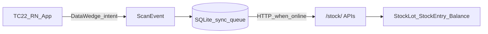

# Warehouse mobile app (Unit 2 + Unit 11)

## Context

**Unit 2** (`id=8`) and **Unit 11** (`id=2`) are storage `Location` rows (raw WH vs packing WH), not UOMs. This Django service already owns inventory; the TC22 app is a **client**.

**Defaults locked for this plan:** React Native; DataWedge **intent** mode; MVP = **goods-in + goods-out**; same-site `POST /stock/transfer/` (no Unit 2↔11 `in_transit` two-step yet); MDM APK (not Play Store).

---

## What you already have (do not rebuild)

| Need | Endpoint / doc |
|------|----------------|
| Resolve scan → product + FIFO batches | `GET /stock/scan/?code=&location_id=` — [barcode_scan_frontend_integration.md](stock_ledger/docs/barcode_scan_frontend_integration.md) |
| Goods-in | `POST /stock/lots/` + `POST /stock/receipt/` (`location_id` = 8 or 2) |
| Label payload | `GET /stock/products/<id>/label/` (+ optional `lot_id`); print via Zebra printer / existing print path |
| Stock on hand | `GET /stock/balances/?location_id=` / `GET /stock/warehouse/remaining/` |
| Goods-out | `POST /stock/transfer/` (+ optional `unit_moves`); always send `idempotency_key` |
| Suppliers / storage list | `/container/suppliers/`, `/container/storage/` |

Contract rules that shape the UI:
- Barcode is usually `P{product_id}` (or bare id / GS1 serial) — **batch is chosen on screen** from FIFO list.
- Goods-in supplier → Unit 2/11 often uses **one 4×6 pallet label** (`label_mode` `product`/`batch`), not per-bag stickers.
- Print never moves stock; only receipt/transfer/consume do.

---

## What to build (new)

### 1. App shell (React Native)
- Auth against existing `/auth/` (or shared Gazebo token).
- Site picker: **Unit 2** vs **Unit 11** (hardcode or load from `/container/storage/`).
- Glove UI: large targets, high contrast, minimal typing, scan-first screens.
- Kiosk / lock-task friendly (single launcher activity).

### 2. Scanner integration (hardware, not camera)
- Configure DataWedge profile per package (intent broadcast with barcode + symbology).
- Use `react-native-datawedge-intents` (or thin native module) → app-wide scan bus.
- Prototype can start in keystroke mode; **ship intent mode**.
- Map hardware trigger only for scan (no camera barcode lib).

### 3. MVP screens

| Screen | Behavior | APIs |
|--------|----------|------|
| **Home** | Site + Goods In / Goods Out / Remaining | — |
| **Goods In** | Supplier → product → qty → create lot + receipt → optional print | lots, receipt, label, suppliers |
| **Goods Out** | Scan → show FIFO batches → pick qty → transfer to kitchen/dept | scan, transfer |
| **Remaining** | Quick on-hand for current site | warehouse/remaining or balances |
| **Offline queue** | Pending posts with retry + idempotency keys | local only |

Skip for MVP: picking-list portal, Unit 2↔11 truck `in_transit`, production consume, EMDK.

### 4. Offline-first
- Local SQLite (`op-sqlite` or WatermelonDB): cached scan lookups + **write queue**.
- Writes: generate UUID `idempotency_key` once; retry same key on reconnect.
- Reads: try network; on dead zone show last cache + “offline” banner; block goods-in only if supplier list never synced.
- Do **not** call live API per scan as the only path — queue transfers when Wi-Fi drops by racking.

### 5. Device / ops requirements (non-code)
- Devices: Zebra TC22 (SE4710/SE55 imager), GMS Android 13/14+.
- MDM: StageNow / SOTI / Workspace ONE — signed APK, lock-task, Wi-Fi, DataWedge profile push.
- Label printer path (existing Zebra printers) wired from goods-in success.
- Staging: one device per site first; confirm `location_id` 8 vs 2 in env/config.

### 6. Backend gaps (only if MVP hits them)
- **None required** for goods-in/out against current ledger.
- Later: optional `in_transit` Unit 2↔11 scan-out/in (noted in `.cursor/plans/barcode.md`, skipped in journey plan).
- Later: thin “mobile session” endpoints only if auth/RBAC needs warehouse-role scoping.

---

## Suggested delivery slices

1. **Spike (1–2 days):** blank RN app on TC22 + DataWedge intent → log scan string → call `GET /stock/scan/` against Unit 2.
2. **Goods Out:** scan → FIFO pick → `transfer` with offline queue.
3. **Goods In:** supplier/product/qty → receipt + label.
4. **Hardening:** MDM package, kiosk, remaining screen, Unit 11 profile twin.
5. **Optional:** picking list from `/planning/.../picking-list/`.

---

## Required checklist

**People / stack:** RN (or Kotlin if team prefers native; Zebra docs are richer) + one Android/DataWedge owner.

**Hardware:** TC22s, imager configured, MDM, printers for pallet labels.

**App:** intent scanner, site context (8/2), goods-in, goods-out, offline sync + idempotency, glove UI.

**Backend:** reuse [`stock_ledger`](stock_ledger/) — no new tables for MVP.

**Ops:** signed APK distribution, DataWedge profiles, lock-task, Wi-Fi dead-zone testing on both sites.
