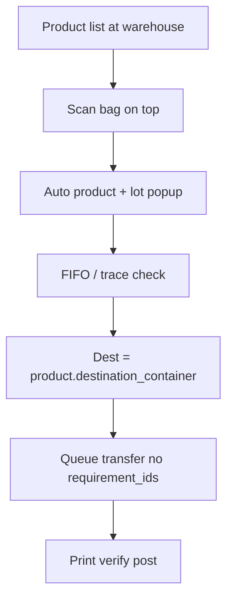

# Phase 2 brief — Goods Out (With plan / Without plan)

**Depends on:** Phase 1 Goods In A/B/C shipped on mobile  
**Apps:** `svc-locations-django` + `warehouse-mobile-app`  
**Do not change** existing plan-based Goods Out scan → FIFO → transfer queue → print → verify.

---

## Goal

| Tab | Behaviour | Backend |
|---|---|---|
| **A. With plan** | Existing flow only | Unchanged portal + transfer queue |
| **B. Without plan** | Product list + **scan-first** → auto product → classic FIFO/trace → auto dest → queue/print/verify | Transfer **without** `requirement_ids` |

**UX bar:** less effort — user mainly scans and respects **trace / FIFO**. Destination and product come from scan + product master.

---

## Tab A — With plan (already live — no disruption)

Floor today:

1. Plan day → category → requirement  
2. Scan bag → FIFO  
3. Queue transfer → print Goods OUT → verify → post  

**Hard rule:** do not regress this path.

---

## Tab B — Without plan (new) — locked flow

### Screen (one main screen + confirm)

1. **Product list** on screen (stock at this warehouse / recent raws — same spirit as remaining list; searchable).
2. **Scan on top** — scan bag / sticker → **auto popup that product + lot** (no manual product pick if scan succeeds).
3. **Classic Goods Out rules** (same as Tab A):
   - wrong product / wrong location → block  
   - **FIFO / trace check** (main operator job)  
   - override + reason only if they skip oldest  
4. **Destination auto** from product `destination_container` (hidden; not a picker).
5. **Qty** default = full bag remaining (edit only if partial).
6. Confirm → **reuse** Goods Out Complete → Verify (print / scan / post).

No plan day / category / requirement / dest picker chrome.

### APIs (mostly reuse)

| Step | API |
|---|---|
| List / search products with stock | existing balances / product search at `location_id` |
| Scan + FIFO / trace | existing `scan/goods-out` + `check_fifo=1` |
| Dest | from scanned product `destination_container_id` (return on scan/product payload if missing) |
| Queue | `POST /stock/transfer/` `queue_stock: true` — **omit** `requirement_ids`; `to_location_id` = product dest |
| Print / verify / post | same as Tab A |

**Django:** confirm transfer allows missing `requirement_ids`. Ensure scan/product payload exposes `destination_container_id` (+ name) for the phone. No new session table.

### Hard rules

1. Tab A paths unchanged.  
2. Never invent a planning requirement.  
3. Still **transfer**, not `issue`.  
4. FIFO + override audit same as Tab A — **trace checking is the main floor control**.  
5. Dest always from product master; if product has no `destination_container` → block with clear message (fix data, do not free-type).  
6. Auth: warehouse JWT + `goods_out` write.

---

## Field matrix

| Field | A With plan | B Without plan |
|---|---|---|
| product | from requirement | **scan → auto** (list for browse) |
| from_location | app warehouse | app warehouse |
| to_location | plan line (hidden) | **product.destination_container** (auto) |
| qty | vs requirement | default full bag; optional partial |
| requirement_ids | yes | **no** |
| FIFO / trace | yes | **yes (primary UX)** |
| queue → print → verify | yes | yes |

---

## Chunks

| Chunk | Side | Outcome | Status |
|---|---|---|---|
| **1** | Plan | This brief | done |
| **2** | Django | Transfer without `requirement_ids`; dest on scan/product; Postman | **done** |
| **3** | Mobile | Goods Out tabs; Without-plan list+scan screen; reuse Complete/Verify | next |

---

## Out of scope (v1)

- Dest location picker / free text  
- Write-off (`issue`)  
- Multi-bag cart in one confirm (one scan → one confirm first; extend later)  
- Changing Tab A FIFO/label/post rules  

---

## Approve to start Chunk 2

~~Locked defaults — approved. Chunk 2 done.~~

**Mobile (Chunk 3):** list + scan → use `to_location_id` from scan; queue transfer omitting `requirement_ids` and `to_location_id`; same Complete/Verify as With plan.
