# Buyer Category, Global Stocks, and Purchase Order Follow-up

**Gazebo Cloud · Management pack**  
**Date:** 17 September 2026  
**Status:** Proposed — not built yet  
**For:** Management

How to use this pack: read each section, look at the numbered picture, leave the evidence table empty. After the developer finishes, record your screen and paste the file or a link in that table.

---

## 1. Why we are doing this

Buyers and planners need a simple label on raw materials: **Key product**, **Other product**, or **Planner monitor**. Admin sets that label on the product. It can be changed later. Every change is kept in the product timeline.

Global Stocks should filter like the Products page (category, sub-category, sub-sub category), plus this new buyer label. The Location filter we already have stays.

People should tick which columns they see. If they hide Trace or Supplier, quantities add up. Unit 2 and Low Risk never mix.

Open purchase orders sit on the right of that report. When warehouse finishes goods-in for a PO, that PO leaves the report and the next one moves up.

Each night at **00:10** we email the list of POs still Ordered or Partial.

Planning Excel can optionally add one sheet that totals the same raw material across recipe levels.

We will not break what already works.

---

## Picture 1. The whole change, step by step

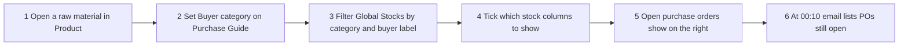

Planning Excel can also add one extra sheet that totals the same raw material.

---

## Picture 2. Who does what

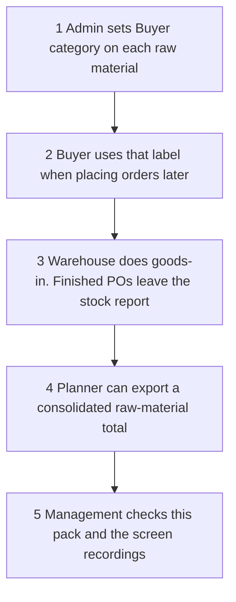

---

## 2. Req 1 — Buyer category

**What it is.** Three labels on a raw material.

- **Key product** — used a lot, important every day
- **Other product** — not a key product
- **Planner monitor** — the production planner watches it and orders when needed

**Where it lives.** Product → Purchase → Guide. New row: Buyer category.

**Who uses it.** Admin sets it. Buyers use it later when placing orders.

It can be edited any time. The timeline records the old value, the new value, who, and when.

**What “done” looks like.** The dropdown saves. The timeline shows the change. Old Purchase Guide fields still work.

### Picture 3. How admin sets Buyer category

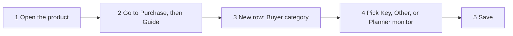

### Picture 4. How the audit log stores each change

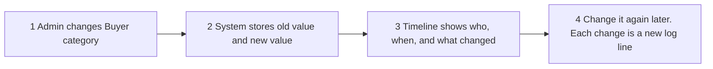

### Evidence of outcome (after developer)

Leave blank until you record the screen.

| Field | Fill in after the work is done |
| --- | --- |
| Date recorded | ________________________________ |
| Recorded by | ________________________________ |
| Screen recording / screenshot | ________________________________ |
| Pass / Fail | ________________________________ |
| Notes | ________________________________ |

---

## 3. Req 2 — Filters on Global Stocks

Add the same category menus as the Products page, plus Buyer category. Keep Location.

- Category → Sub-category → Sub-sub category
- Buyer category (the three labels from Req 1)
- Location stays (Unit 2, Low Risk, and other warehouse names)

Search, Item, Warning, and Hide zero stay as they are.

**What “done” looks like.** You can narrow the list by product tree, buyer label, and location, without losing the filters you already have.

### Picture 5. Filter order on Global Stocks

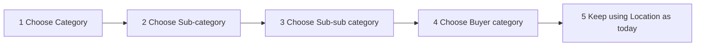

### Evidence of outcome (after developer)

| Field | Fill in after the work is done |
| --- | --- |
| Date recorded | ________________________________ |
| Recorded by | ________________________________ |
| Screen recording / screenshot | ________________________________ |
| Pass / Fail | ________________________________ |
| Notes | ________________________________ |

---

## 4. Req 3 — Column chooser

The table can show many columns. You choose which ones are visible. Extra columns scroll to the right.

**What “done” looks like.** Right-click works. Hidden columns come back when you tick them again. The page scrolls sideways.

### Picture 6. Right-click the header

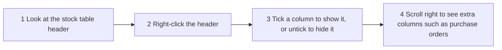

### Evidence of outcome (after developer)

| Field | Fill in after the work is done |
| --- | --- |
| Date recorded | ________________________________ |
| Recorded by | ________________________________ |
| Screen recording / screenshot | ________________________________ |
| Pass / Fail | ________________________________ |
| Notes | ________________________________ |

---

## 5. Req 3.1 — Add qty when a split column is hidden

Product code is the identity. Product name stays with it.

**Hard rule.** Locations never merge. Unit 2 and Low Risk stay separate even when Trace or Supplier is hidden.

**What “done” looks like.** Hide Trace or Supplier and qty adds inside the same location. Two warehouses stay two rows.

### Picture 7. Peas — hide Trace, add qty

**Before**

- Peas | Unit 2 | Trace A | 10 kg
- Peas | Unit 2 | Trace B | 8 kg
- Two rows. Same product. Same location.

**After**

- Peas | Unit 2 | 18 kg
- One row. Qty 10 + 8 = 18 kg.

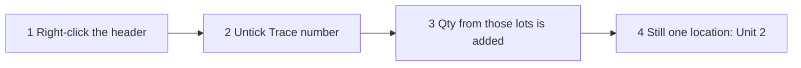

### Picture 8. Salt — hide Supplier, add qty

**Before**

- Salt | Unit 2 | Supplier A | 5 kg
- Salt | Unit 2 | Supplier B | 5 kg
- Salt | Unit 2 | Supplier C | 5 kg
- Salt | Unit 2 | Supplier D | 5 kg

**After**

- Salt | Unit 2 | 20 kg
- One row. 5 + 5 + 5 + 5 = 20 kg.

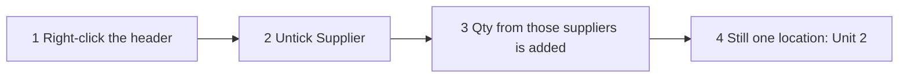

### Picture 9. Do not mix locations

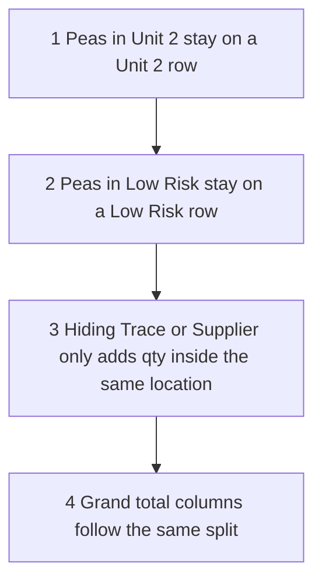

### Evidence of outcome (after developer)

| Field | Fill in after the work is done |
| --- | --- |
| Date recorded | ________________________________ |
| Recorded by | ________________________________ |
| Screen recording / screenshot | ________________________________ |
| Pass / Fail | ________________________________ |
| Notes | ________________________________ |

---

## 6. Req 4 — Future purchase orders on the report

On the right of Global Stocks, each product row can show open POs. Soonest delivery first.

- Each PO slot: remaining qty, delivery date, PO number
- PO 1, then PO 2, then PO 3, as needed
- Only Ordered and Partial POs. Not draft, not cancelled, not fully received

**Goods-in rule.** If PO 43123 ordered 90 kg and warehouse received 40 kg, the row still shows that PO with 50 kg left. When the last 50 kg is received, that PO disappears and the next future PO moves into first place.

**What “done” looks like.** Open POs show. Remaining qty is correct. Finished POs leave. The next PO takes their place.

### Picture 10. How future POs appear on the row

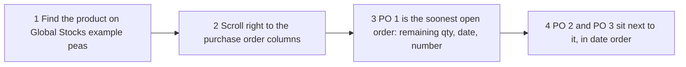

### Picture 11. Goods-in moves the list

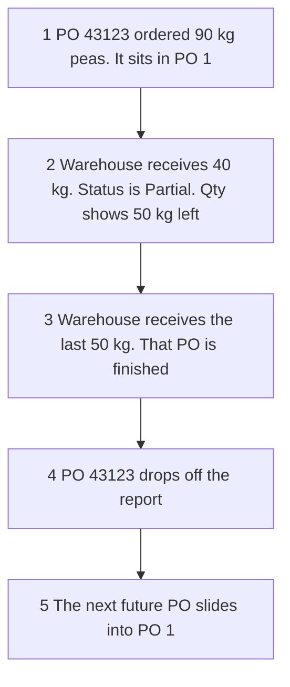

### Evidence of outcome (after developer)

| Field | Fill in after the work is done |
| --- | --- |
| Date recorded | ________________________________ |
| Recorded by | ________________________________ |
| Screen recording / screenshot | ________________________________ |
| Pass / Fail | ________________________________ |
| Notes | ________________________________ |

---

## 7. Req 5 — Three quantity columns

- **Current stock qty** — already on the page
- **Future order stock qty** — total remaining qty on open POs for that row
- **Grand total** — current + future

Example. Peas: 100 kg in stock. 50 kg still on open POs. Grand total 150 kg.

**What “done” looks like.** The three numbers match stock plus remaining PO qty, and they follow the same location split as Req 3.1.

### Picture 12. How the three qty columns are built

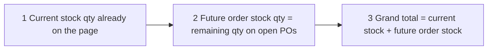

### Evidence of outcome (after developer)

| Field | Fill in after the work is done |
| --- | --- |
| Date recorded | ________________________________ |
| Recorded by | ________________________________ |
| Screen recording / screenshot | ________________________________ |
| Pass / Fail | ________________________________ |
| Notes | ________________________________ |

---

## 8. Req 6 — Reminder email at 00:10

Same idea as the closing stock email: a short branded message and a file attached. Addresses are set in the app.

- Include: Ordered (nothing received yet) and Partial (some received, not finished)
- Exclude: Draft, Received, Cancelled
- Sort: newest PO date first (16 Sep, then 15 Sep, then 14 Sep)
- This is the full open list each night, not a “only new since yesterday” list

**What “done” looks like.** At 00:10 the named inboxes get the email. The list matches open POs in the system, newest first.

### Picture 13. Night job, newest PO date first

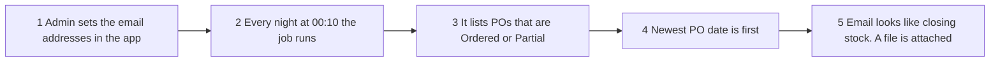

### Evidence of outcome (after developer)

| Field | Fill in after the work is done |
| --- | --- |
| Date recorded | ________________________________ |
| Recorded by | ________________________________ |
| Screen recording / screenshot | ________________________________ |
| Pass / Fail | ________________________________ |
| Notes | ________________________________ |

---

## 9. Req 7 — Planning Excel, consolidated raw material

Today the plan Excel lists each requirement on its own row. Peas at one level and peas at another level are two rows.

**What “done” looks like.** A popup asks if you want the consolidated sheet. If yes, peas 2 kg + 10 kg become 12 kg. Plan Requirements and Working do not change.

### Picture 14. Optional extra sheet. Old sheets stay

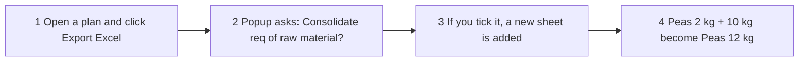

### Evidence of outcome (after developer)

| Field | Fill in after the work is done |
| --- | --- |
| Date recorded | ________________________________ |
| Recorded by | ________________________________ |
| Screen recording / screenshot | ________________________________ |
| Pass / Fail | ________________________________ |
| Notes | ________________________________ |

---

## 10. What we will not break

### Picture 15. Existing working parts stay

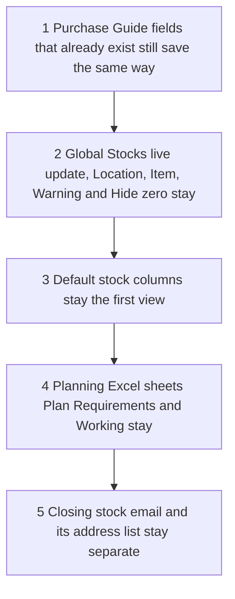

- Purchase unit, format and version on Guide
- Product timeline (we only add the new field into it)
- Global Stocks live feed and current filters
- The nine columns you see today remain the default view
- Planning Excel sheets Plan Requirements and Working
- Closing stock email and its own address list

---

## 11. Sign-off

This pack describes the work. It is not built yet. Sign when the understanding is accepted. After build, fill the evidence tables with screen recordings.

| | |
| --- | --- |
| Prepared for management | Date: 17 Sep 2026 |
| Approved by (name / signature) | Date: ________ |
| Ready for developers to build | Yes / No: ________ |
| Evidence pack complete (after build) | Yes / No: ________ |

---

To get a real Word file (`.docx`) with pictures inside: switch this chat to Agent mode and say **generate word**. Plan mode cannot create `.docx` files.
