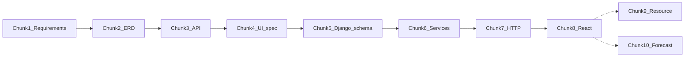

# Planning Module Redesign — Chunk List

Work **one chunk at a time**. Approve → produce artifact → **commit + push to `Plan` on both repos** → stop.

## Git rule (mandatory)

Branches:

| Repo | Branch |
|------|--------|
| `svc-locations-django` | `Plan` |
| `gazeboo-cloud-web` | `Plan` |

After **every** approved chunk:

1. Update working copy under `C:\Users\Pallavi\projects\ERP\planning-redesign\`
2. Sync the same files into **both** repos at `docs/planning-redesign/`
3. For code chunks (5–8): also commit the real app changes in that repo
4. On **each** repo:
   - `git checkout Plan`
   - `git add …`
   - `git commit -m "…"`
   - `git push -u origin Plan` (first time) / `git push origin Plan`

Do **not** push Planning work to `main` until you ask for a PR.

## Full chunk list

| Chunk | Name | Type | Deliverable | Status |
|------:|------|------|-------------|--------|
| **1** | Legacy map + requirements | Design doc | [chunk-01-requirements/PLANNING_REQUIREMENTS.md](chunk-01-requirements/PLANNING_REQUIREMENTS.md) | **DONE** (on `Plan`) |
| **2** | Database ERD | Design doc | [chunk-02-erd/PLANNING_ERD.md](chunk-02-erd/PLANNING_ERD.md) | **DONE** (on `Plan`) |
| **3** | API contracts | Design doc | [chunk-03-api/PLANNING_API.md](chunk-03-api/PLANNING_API.md) | **DONE** (on `Plan`) |
| **4** | Frontend UI spec | Design doc | [chunk-04-ui/PLANNING_UI.md](chunk-04-ui/PLANNING_UI.md) | **DONE** (on `Plan`) |
| **5** | Django schema | Code | [chunk-05-django-schema/NOTES.md](chunk-05-django-schema/NOTES.md) + `planning/` app | **DONE** (on `Plan`) |
| **6** | Django MRP services | Code | [chunk-06-services/NOTES.md](chunk-06-services/NOTES.md) | **DONE** (on `Plan`) |
| **7** | Django HTTP APIs | Code | [chunk-07-http-api/NOTES.md](chunk-07-http-api/NOTES.md) + `/planning/` | **DONE** (on `Plan`) |
| **8** | React Planning UI | Code | [chunk-08-react-ui/NOTES.md](chunk-08-react-ui/NOTES.md) + `gazeboo-cloud-web/src/features/planning/` | **DONE** (local — commit/push `Plan` when ready) |
| **9** | Resource board | Code | [chunk-09-resource-board/NOTES.md](chunk-09-resource-board/NOTES.md) | **DONE** (local — commit/push `Plan` when ready) |
| **10** | Forecast / shortage | Code | [chunk-10-forecast/NOTES.md](chunk-10-forecast/NOTES.md) | **DONE** (local — commit/push `Plan` when ready) |

Chunks 1–4 = design only (`docs/planning-redesign/`). Chunks 5–8 = code in the matching app repo on `Plan`.
