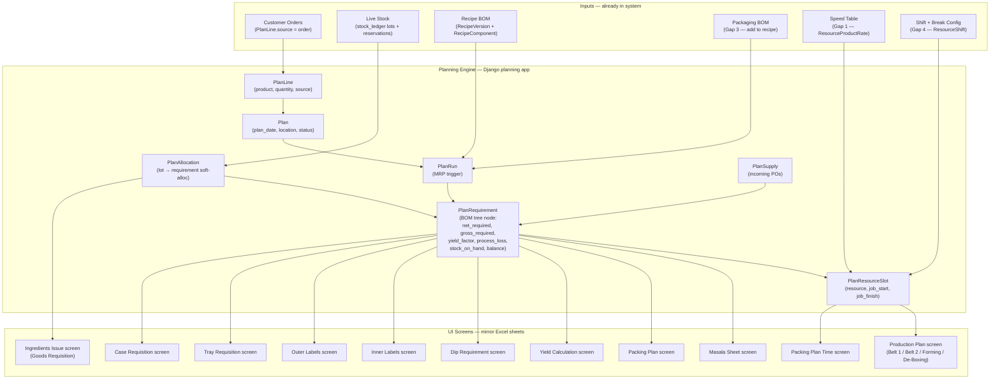
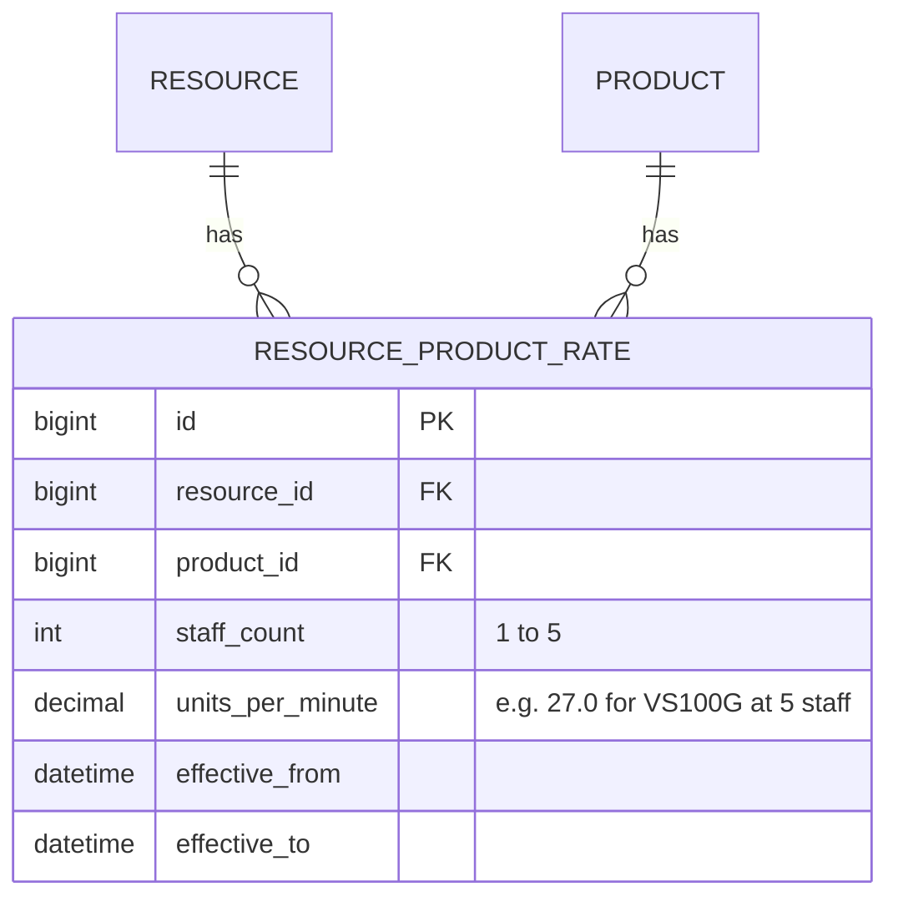
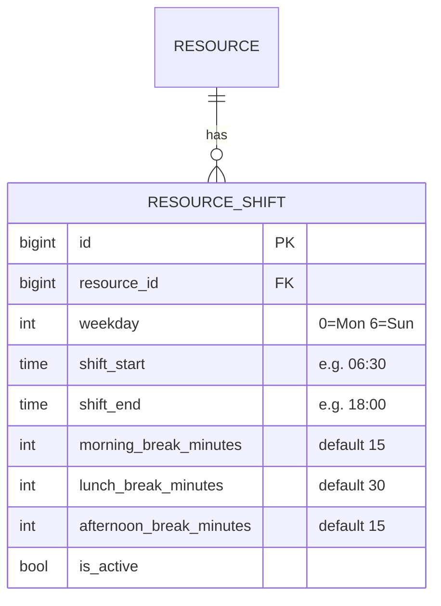
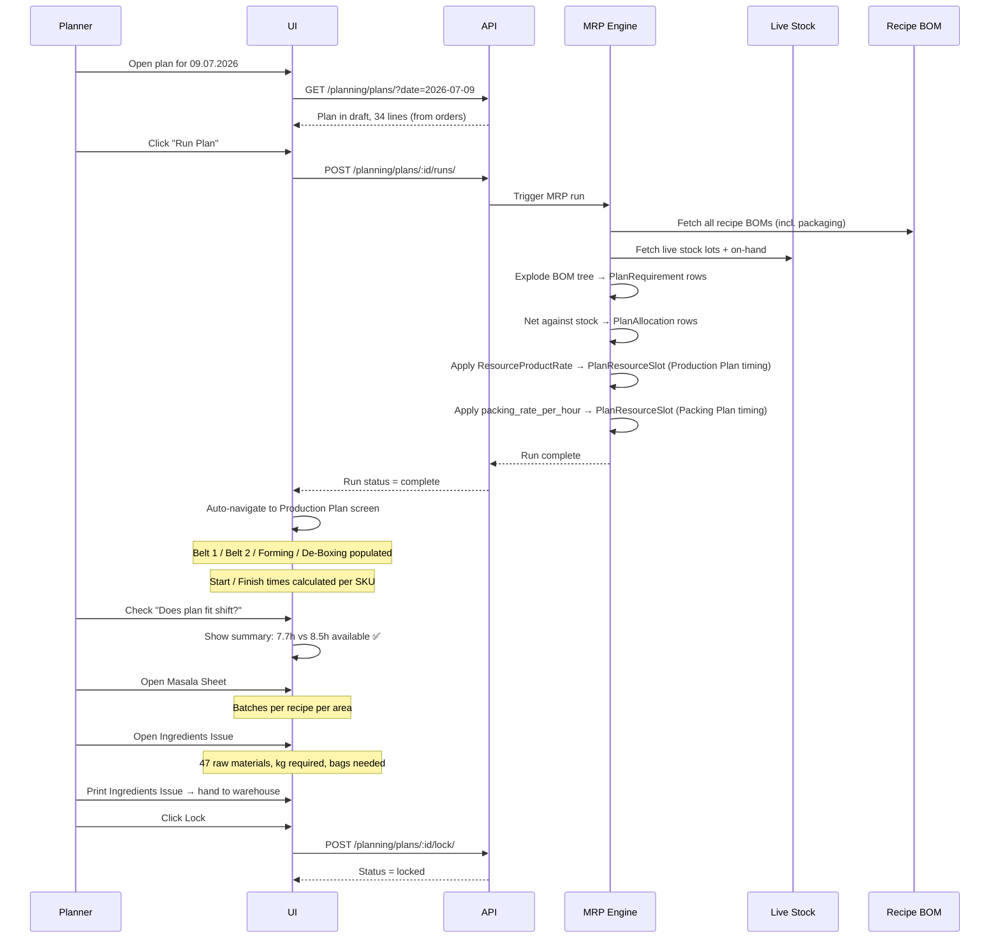

# Factory Planning System — Parity Plan
**Goal:** Replace the legacy Excel planning tool with the Gazebo system so the production planner can run a full factory day from one screen — no Excel required.

**Terminology rule:** Every screen, field, label, and button in the UI must use the same words the factory floor uses. Names below are taken directly from the Excel the planner uses today.

---

## 1. What the planner does today (Excel walkthrough)

The planner (currently Kruti Rathod) opens one `.xlsm` file each morning and works through it in this order:

```
HOME
 ├── enters Plan Date + their name
 └── heading auto-stamps (e.g. "09.07.2026 GAZEBO PLAN THURSDAY")

PRODUCTION PLAN (Plan sheet)
 ├── Belt 1 — larger samosas (VS100G, VS140G, VS25G, VS40G, VSR50G)
 ├── Belt 2 — chicken/lamb samosas (CTS100G, CTS75G, LS40G, LS75G, LS100G, CTS100G)
 ├── Forming — bhajis/pakoras (OB40G, VP30G, OB100G)
 └── De-Boxing — outsourced/pre-fried products (GZRM297, CS40G-WEI1, CSR30G-WEI, OB40G-SRI1…)
 
 For each SKU in each area:
   → Total Units Required (from orders/forecast)
   → Batches (how many mixer batches needed)
   → Units To Produce (rounded up to full batch)
   → NOP (Number Of People on that station — 1 to 5)
   → Units Per Min (auto looked-up from master speed table by SKU + NOP)
   → Min (minutes = Units To Produce ÷ Units Per Min)
   → Men Mins (man-minutes = NOP × Min)
   → Time (day fraction = Min ÷ 1440)
   → Start / Finish (sequential chain per area; each SKU starts when previous finishes)
   → Cumulative Time (running total per area)

 Summary sidebar:
   → Total Hours, Total Men Mins, Production Start, Production Finish
   → Breaks: Morning Tea (15 min), Lunch (30 min), Evening Tea (15 min)
   → Overall Working Hours (including breaks)

MASALA SHEET
 ├── Folding Products (samosas/spring rolls) — batches per recipe
 ├── Forming (bhajis/pakoras)
 ├── Ready Meals (sauces, rice, proteins)
 └── Cooking (marinated chicken, steamed veg)

PACKING PLAN
 ├── Gazebo Retail Packs – SK4
 ├── Booths range
 ├── Takul / Isla range
 ├── Mixed Cases (Lidl)
 ├── Booker / FreshDirect range
 ├── Grab & Go (Ginster / Food-to-Go)
 └── Ready Meals

 Per SKU: Code | Packing Name | Pack Weight | Customer | Price Mark |
          Packaging Type | Name Of Tray | Case Size | Cases |
          Tray Quantity | Actual Qty Packed | Machine Name |
          Content Code 1…7 | Content Qty 1…7 |
          Dip Code | Dip | Dip Qty |
          Total Content 1…7 | Total Dip |
          Type | Case Name | Inner Label | Outer Label | Sleeves/Labels |
          Sleeve Ref | Brand | Product Category | Status |
          Tray Order Code | Tray Supplier | Case Order Code | Allergen | Packing Sequence

INGREDIENTS ISSUE (Goods Requisition Form)
 → One row per raw material
 → Purchase Code | Ingredient Name | Pack Size (Kg) | Ingredients (KG) |
   Bags/Qty Required | Qty Received | Trace No | USE BY / BBE | Temp | Defrosted Y/N

YIELD CALCULATION
 → Description | Recipe Ref | Batches | Sum of Total Ingredients (g) |
   Yield % | Yield Weight (g) | Yield Weight (kg)

PACKING PLAN TIME
 → Per packing SKU: Rate Per Hour | Cases Per Minute | Min | Start | End

SUPPORTING SHEETS (auto-derived from above)
 → Dip Requirement
 → Inner Labels
 → Outer Labels
 → Tray Requisition
 → Case Requisition
 → Fresh Product Stock
 → Ready Meals Stock
 → Masala Sheet (already listed above)
```

---

## 2. System architecture — how the Django backend maps



---

## 3. Terminology map — Excel → System

| Excel word | System word | Notes |
|---|---|---|
| Plan Date | `plan_date` | Date field on Plan |
| Planning By | `created_by_name` | User who created the plan |
| Area | `resource.name` | Belt 1, Belt 2, Forming, De-Boxing, Table |
| Code | `product.code` (SKU code) | e.g. VS100G, CTS100G |
| Recipe Reference | `recipe_version.recipe.code` | e.g. GFF003R |
| Description | `product.name` | e.g. Vegetable Samosa Large 100G |
| Total Units Required | `plan_line.quantity` | Demand input |
| Batches | `plan_requirement.batch_number` | Derived from batch size |
| Units To Produce | `plan_requirement.gross_required` | After process loss + rounding |
| Leftover Plan From Day Before | `plan_supply.kind = opening` | Stock carried over from prior plan |
| NOP (Number Of People) | `plan_resource_slot.staff_count` | 1–5 headcount |
| Units Per Min | `resource_product_rate.rate` | Gap 1 — needs new model |
| Min | derived: `gross_required ÷ rate` | Calculated in schedule service |
| Men Mins | derived: `NOP × Min` | Calculated in schedule service |
| Cum Time | `plan_resource_slot.cumulative_minutes` | Running sum per area |
| Start | `plan_resource_slot.job_start` | Datetime |
| Finish | `plan_resource_slot.job_finish` | Datetime |
| Morning Tea / Lunch / Evening Tea | `resource_shift.break_*` | Gap 4 — needs new model |
| Overall Working Hours | derived from shift + breaks | Shown in Production Plan summary |
| Masala Area | `resource.group.name` | Folding Products / Forming / Ready Meals / Cooking |
| Batches (Masala) | `plan_requirement.batch_number` | Aggregated by recipe per area |
| Packing Name | `product.name` | Retail pack description |
| Pack Weight | `product.gross_unitary_weight` | In grams |
| Customer | `product.brand` or order customer | Gazebo / Booths / Takul / Lidl etc. |
| Packaging Type | `packaging_component.packaging_type` | Gas Flushed / Non Gas Flushed |
| Name Of Tray | `packaging_component.tray_name` | e.g. SK4-Split Clear |
| Case Size | `packaging_component.case_size` | e.g. 1 x 6 |
| Cases | entered by packing team | `plan_line.actual_cases` |
| Tray Quantity | derived: `Cases × trays_per_case` | Calculated |
| Content Code 1…7 | recipe component codes | Sub-SKUs in packing BOM |
| Content Qty 1…7 | recipe component quantities | Units per tray |
| Sleeve Ref | `packaging_component.sleeve_ref` | e.g. S775-03 |
| Inner Label / Outer Label | `packaging_component.inner_label_id` | e.g. Inner - 454 |
| Tray Order Code | `packaging_component.tray_order_code` | e.g. PKESS001-06 |
| Case Order Code | `packaging_component.case_order_code` | e.g. PKCON001-07 |
| Allergen Category | `product.allergen_category` | 1–3 severity |
| Allergen Name | `product.allergen_name` | Wheat, Soya, Milk, etc. |
| Packing Sequence | `plan_line.sort_order` | Order in packing plan |
| Purchase Code | `recipe_component.raw_material.purchase_code` | e.g. RMDAR001-01 |
| Ingredients (KG) | `plan_requirement.gross_required` (converted to kg) | Total kg to issue |
| Bags/Qty Required | `plan_requirement.gross_required ÷ pack_size` | Ceiling rounded |
| Pack Size (Kg) | `raw_material.pack_size_kg` | Supplier pack size |
| Yield % | `plan_requirement.yield_factor` | Entered on recipe |
| Rate Per Hour | `resource.packing_rate_per_hour` | Gap 2 — cases/hr per machine |
| Cases Per Minute | derived: `rate_per_hour ÷ 60` | Calculated |
| High Risk WIP | `product.is_high_risk` | Boolean flag |
| Freezer Stock | `plan_supply.kind = freezer_stock` | Stock from freezer |
| Out Sourced / Produced | `product.is_outsourced` | Boolean flag |
| Status | `product.status` | Live / Discontinued |
| Version No / Version Date | `plan.version`, `plan.updated_at` | Plan versioning |

---

## 4. The 4 gaps to close (what needs to be built)

### Gap 1 — Speed Table (`ResourceProductRate`)

**What Excel does:** The `Additional Requirement` sheet stores units-per-minute for every SKU at every headcount level (1 person, 2 people, 3, 4, 5). The Production Plan VLOOKUPs into this to compute `Min` and `Men Mins` automatically.

**What we need:**



**Example data (from Excel today):**

| Product | 5 staff | 4 staff | 3 staff | 2 staff | 1 staff |
|---|---|---|---|---|---|
| VS100G (Veg Samosa 100g) | 27.0 | 21.6 | 16.2 | 10.8 | 5.4 |
| CTS100G (CK Tikka Samosa 100g) | 25.0 | 20.0 | 15.0 | 10.0 | 5.0 |
| OB40G (Onion Bhaji 40g) | 40.0 | 32.0 | 24.0 | 16.0 | 8.0 |
| VP30G (Veg Pakora 30g) | 40.0 | 32.0 | 24.0 | 16.0 | 8.0 |

**Impact:** Once seeded, `schedule.py` can auto-calculate `Min`, `Men Mins`, `Start`, `Finish` for every SKU in the Production Plan.

---

### Gap 2 — Packing Rate per Machine (`Resource.packing_rate_per_hour`)

**What Excel does:** The `Packing Plan Time` sheet stores rate-per-hour per packing machine/tray type. `Cases Per Minute = rate ÷ 60`, then `Min = Cases ÷ Cases Per Minute`.

**What we need:**

Add `packing_rate_per_hour` (decimal, nullable) to the `Resource` model. When set on a packing resource (e.g. Reepack machine), the packing schedule service uses it to compute packing time per SKU.

**New packing schedule service** (`planning/services/packing_schedule.py`):
```
input:  PlanResourceSlot rows for packing resources
logic:  cases ÷ (packing_rate_per_hour ÷ 60) = minutes
        chain: each SKU starts when previous finishes
output: job_start, job_finish per packing slot
```

---

### Gap 3 — Packaging BOM in Recipes

**What Excel does:** The Packing Plan encodes a full packaging bill of materials per SKU: tray type, case, sleeve/label, inner label, outer label — up to 7 content components. This drives the Tray Requisition, Case Requisition, Inner Labels, and Outer Labels sheets automatically.

**What we need:** Packaging materials must be first-class `RecipeComponent` entries in the recipe app, tagged with a new `component_type = packaging` (vs existing `component_type = ingredient`). Fields needed:

| Field | Example |
|---|---|
| `tray_order_code` | PKESS001-06 |
| `tray_supplier` | ENVIROPAX LTD |
| `tray_inventory_code` | SK4-SPLITCL1 |
| `case_order_code` | PKCON001-07 |
| `inner_label_id` | 454 |
| `outer_label_id` | 527 |
| `sleeve_ref` | S775-03 |
| `packaging_type` | Gas Flushed / Non Gas Flushed |
| `tray_name` | SK4-Split Clear |
| `case_size` | 1 x 6 |

Once in the BOM, MRP explosion via `explode.py` will automatically include packaging quantities in `PlanRequirement`, and the picking list will include trays/cases/labels without any extra code.

---

### Gap 4 — Shift & Break Configuration (`ResourceShift`)

**What Excel does:** Hardcodes break durations per day (Morning Tea 15 min, Lunch 30 min, Evening Tea 15 min). Subtracts them from total available hours to compute `Overall Working Hours`. Raises no alert — the planner eyeballs it.

**What we need:**



**New derived field in Production Plan:** `Available Hours = shift_end − shift_start − total_breaks`. System shows **⚠ Plan exceeds shift** when `Total Min > Available Hours`.

---

## 5. UI screens — one screen per Excel sheet

### Screen 1: Production Plan
**Route:** `/planning/plans/:planId/production-plan`  
**Excel equivalent:** `Plan` sheet

```
+──────────────────────────────────────────────────────────────────────────────+
│  09.07.2026 GAZEBO PLAN THURSDAY          Status: Draft   [Run Plan] [Lock]  │
│  Planning By: Kruti Rathod                                                   │
├──────────────────────────────────────────────────────────────────────────────┤
│  BELT 1                                               Start: 06:30           │
│  Code     Description               Units Req  Batches  Units To Produce  NOP  Units/Min  Min   Men Mins  Start  Finish  │
│  VS100G   Vegetable Samosa 100G     12,178     5.25     12,180           5    27.0       451   2,255     06:30  13:59   │
│  VS140G   Vegetable Samosa XL 140G  1,500      6.75     1,519            5    ...        ...   ...       13:59  ...     │
│  ...                                                                                                                    │
│  Belt 1 Total                       22,126     14.53    22,355                                                          │
├──────────────────────────────────────────────────────────────────────────────┤
│  BELT 2                                               Start: 06:30           │
│  ...                                                                         │
├──────────────────────────────────────────────────────────────────────────────┤
│  FORMING                                              Start: 06:30           │
│  ...                                                                         │
├──────────────────────────────────────────────────────────────────────────────┤
│  DE-BOXING                                            Start: 06:30           │
│  ...                                                                         │
├──────────────────────────────────────────────────────────────────────────────┤
│  SUMMARY                                                                     │
│  Total Hours: 8.2h   Total Men Mins: 24,800   Production Start: 06:30        │
│  Production Finish: 14:42   Overall Working Hours: 7.7h (excl. breaks)       │
│  ✅ Plan fits within shift                                                    │
+──────────────────────────────────────────────────────────────────────────────+
```

**Data source:**
- Rows = `PlanRequirement` filtered to production resources (Belt 1, Belt 2, Forming, De-Boxing)
- `Units To Produce` = `gross_required`
- `Units/Min` = `ResourceProductRate.rate` for (product × NOP)
- `Start / Finish` = `PlanResourceSlot.job_start / job_finish`
- `Batches` = `plan_requirement.batch_number`

---

### Screen 2: Masala Sheet
**Route:** `/planning/plans/:planId/masala-sheet`  
**Excel equivalent:** `Masala Sheet`

```
+──────────────────────────────────────────────────────────────────────────────+
│  TODAY MASALA MIX                        09.07.2026 Thursday                │
├──────────────────────────────────────────────────────────────────────────────┤
│  FOLDING PRODUCTS                                                            │
│  Recipe Name                    Recipe Ref   Allergen          Batches       │
│  Chicken Tikka Samosa           GFF004R      Wheat, Soya       2.75          │
│  Lamb Samosa                    GFF005R      Soya, Wheat       1.75          │
│  Vegetable Samosa               GFF003R      Wheat             5.53          │
│  ...                                                                         │
├──────────────────────────────────────────────────────────────────────────────┤
│  FORMING                                                                     │
│  Onion Bhaji                    GFF121R      —                 7.25          │
│  Vegetable Pakora               GFF122R      —                 3.25          │
├──────────────────────────────────────────────────────────────────────────────┤
│  READY MEALS                                                                 │
│  Butter Sauce                   GFF134R      Barley, Milk      0.75          │
│  Thai Green Curry Sauce         GFF148R      Fish, Sesame      2.00          │
│  ...                                                                         │
├──────────────────────────────────────────────────────────────────────────────┤
│  COOKING                                                                     │
│  British Marinated Chicken      GFF164R      —                 0.50          │
│  Steamed Potato Diced           GFF241R      —                 71.0          │
│  ...                                                                         │
+──────────────────────────────────────────────────────────────────────────────+
```

**Data source:**
- Group `PlanRequirement` rows by `resource.group.name` (Folding Products, Forming, Ready Meals, Cooking)
- `Batches` = `plan_requirement.batch_number`
- `Recipe Ref` = `recipe_version.recipe.code`

---

### Screen 3: Packing Plan
**Route:** `/planning/plans/:planId/packing-plan`  
**Excel equivalent:** `PACKING PLAN` sheet

```
+──────────────────────────────────────────────────────────────────────────────+
│  TODAY PACKAGING PLAN            09.07.2026 Thursday         [Print]         │
├──────────────────────────────────────────────────────────────────────────────┤
│  GAZEBO RETAIL PACKS – SK4                                                   │
│  #  Code           Packing Name                 Wt    Customer  Cases  Trays  Allergen        │
│  1  CVSR2M-1R6TSP  SP- 4 Veg Spring Rolls       200G  Spar UK   0      0      Wheat, Soya     │
│  2  CVSRM1-R6T     6 Veg Spring Roll - CHINA    180G  CHINA     0      0      Wheat, Soya     │
│  3  CCSRM1-R6T     6 Chicken Spring Roll-CHINA  180G  CHINA     100    600    Wheat, Soya     │
│  ...                                                                                          │
│                                                                                               │
│  [Expand row to see: Packaging Type | Tray | Content Code 1…7 | Dip | Sleeve | Labels]       │
├──────────────────────────────────────────────────────────────────────────────┤
│  BOOTHS RANGE                                                                │
│  ...                                                                         │
├──────────────────────────────────────────────────────────────────────────────┤
│  TAKUL / ISLA RANGE                                                          │
│  ...                                                                         │
├──────────────────────────────────────────────────────────────────────────────┤
│  GRAB & GO RANGE                                                             │
│  ...                                                                         │
+──────────────────────────────────────────────────────────────────────────────+
```

**Data source:**
- Rows = `PlanLine` where product category = retail/packing
- Cases = entered by planner (`plan_line.actual_cases`)
- Tray Qty = `Cases × trays_per_case` (from packaging BOM)
- Content code/qty = recipe component BOM (packaging type components)
- Total content = `Cases × trays_per_case × content_qty`
- Grouped by `product.brand` (Gazebo / Booths / Takul / Lidl / Grab&Go)

---

### Screen 4: Ingredients Issue (Goods Requisition)
**Route:** `/planning/plans/:planId/ingredients-issue`  
**Excel equivalent:** `Ingredients Issue` sheet

```
+──────────────────────────────────────────────────────────────────────────────+
│  GOODS REQUISITION FORM          09.07.2026 Thursday         [Print]         │
├──────────────────────────────────────────────────────────────────────────────┤
│  Purchase Code   Ingredient Name             Pack Size  Ingredients  Bags Req  Qty Recv  Trace No  BBE  Temp  Defrosted │
│  AFFINITY        Water                       1 kg       1,082.7 kg   1,083     ____      ____      ___  ___   ___       │
│  GFF004-1R       Chicken Tikka Samosa Mix    1 kg       420.0 kg     420       ____      ____      ___  ___   ___       │
│  GFF005-1R       Lamb Samosa Mix             1 kg       666.3 kg     667       ____      ____      ___  ___   ___       │
│  RMDAR001-01     Coriander                   1 kg       21.0 kg      21        ____      ____      ___  ___   ___       │
│  ...                                                                                                                    │
│  Total ingredients: 47 lines                                                 │
+──────────────────────────────────────────────────────────────────────────────+
```

**Data source:** `/planning/plans/:planId/runs/:runId/picking-list/` — already exists. Add UI columns for Qty Received, Trace No, BBE, Temp, Defrosted (editable inline — warehouse fills these in during goods issue).

---

### Screen 5: Yield Calculation
**Route:** `/planning/plans/:planId/yield-calculation`  
**Excel equivalent:** `Yield Calculation` sheet

```
+──────────────────────────────────────────────────────────────────────────────+
│  YIELD CALCULATION               09.07.2026 Thursday                         │
├──────────────────────────────────────────────────────────────────────────────┤
│  Description                  Recipe Ref  Batches  Total Ingredients (g)  Yield %  Yield (g)  Yield (kg)  │
│  Butter Sauce                 GFF134R     0.75     102,543.75             —        —          —           │
│  Chicken Tikka Samosa 100G    GFF004R     2.25     687,613.50             —        —          —           │
│  Vegetable Samosa 100G        GFF003R     5.25     1,330,140.00           —        —          —           │
│  ...                                                                       │
+──────────────────────────────────────────────────────────────────────────────+
```

**Data source:** `PlanRequirement` grouped by recipe — `batch_number` and `gross_required` (total grams). `yield_factor` already stored on requirement.

---

### Screen 6: Packing Plan Time
**Route:** `/planning/plans/:planId/packing-plan-time`  
**Excel equivalent:** `Packing Plan Time` sheet

```
+──────────────────────────────────────────────────────────────────────────────+
│  PACKING PLAN TIME    Start: 06:30   End: 14:42   Total: 8.2h   Mins: 492   │
├──────────────────────────────────────────────────────────────────────────────┤
│  Category       Tray          Brand    Code           Packing Name     Cases  Rate/Hr  Cases/Min  Min  Start  End   │
│  BULK-SNACKS    Bag/Box       Gazebo   FLSAM-B20B     Gc-20 Lamb Sam…  14     —        —          0    06:30  06:30  │
│  FOOD TO GO     GRAB & GO SQ  Gazebo   CVSAL-1G6T     Gazebo 1 Veg S…  741    —        —          0    06:30  06:30  │
│  RETAIL-MEALS   EVOLVE CPET   Booths   CCBU-R4TEB     Booths Butter C…  30     —        —          0    06:30  06:30  │
│  ...                                                                         │
+──────────────────────────────────────────────────────────────────────────────+
```

**Data source:** `PlanResourceSlot` for packing resources. `Rate/Hr` from `resource.packing_rate_per_hour` (Gap 2).

---

### Screen 7: Requisition Sheets (Dip / Labels / Trays / Cases)
**Route:** `/planning/plans/:planId/requisitions`  
**Excel equivalent:** `Dip Requirement`, `Inner Labels`, `Outer Labels`, `Tray Requisition`, `Case Requisition`

Single tabbed screen with 5 tabs. All auto-derived from packing BOM × cases packed.

| Tab | What it shows |
|---|---|
| Dip Requirement | Dip code, dip name, total qty (kg) per dip per plan |
| Inner Labels | Label ID, description, quantity required |
| Outer Labels | Label ID, description, quantity required |
| Tray Requisition | Tray order code, supplier, inventory code, quantity |
| Case Requisition | Case order code, quantity |

---

## 6. Navigation structure (Factory Planning)

```
Factory Planning
├── Production Plan          /planning/plans/:id/production-plan
├── Packing Plan             /planning/plans/:id/packing-plan
├── Masala Sheet             /planning/plans/:id/masala-sheet
├── Ingredients Issue        /planning/plans/:id/ingredients-issue
├── Yield Calculation        /planning/plans/:id/yield-calculation
├── Packing Plan Time        /planning/plans/:id/packing-plan-time
├── Requisitions             /planning/plans/:id/requisitions
│   ├── Dip Requirement
│   ├── Inner Labels
│   ├── Outer Labels
│   ├── Tray Requisition
│   └── Case Requisition
└── [Plan list]              /planning/plans
```

The Plan header (date, planner name, status, version) is pinned at the top on every sub-screen. The planner never loses context of which plan they are in.

---

## 7. Data flow — end-to-end (no manual entry)



---

## 8. Build sequence

### Phase A — Data gaps (no UI change needed)

| # | Task | Where | Effort |
|---|---|---|---|
| A1 | Add `ResourceProductRate` model (resource × product × staff_count → units_per_min) | `planning/models.py` + migration | S |
| A2 | Add `ResourceShift` model (start, breaks, end per weekday) | `planning/models.py` + migration | S |
| A3 | Add `packing_rate_per_hour` to `Resource` model | `planning/models.py` + migration | XS |
| A4 | Add packaging material component type + fields to `recipe` app BOM | `recipe/models.py` + migration | M |
| A5 | Seed `ResourceProductRate` from Excel speed table data | management command | S |
| A6 | Seed `ResourceShift` (Mon–Fri 06:30–18:00, standard breaks) | fixture or management command | XS |
| A7 | Seed packaging BOM for all live SKUs | data migration / CSV import | L |

### Phase B — Engine extensions

| # | Task | Where | Effort |
|---|---|---|---|
| B1 | Extend `schedule.py` to use `ResourceProductRate` → populate `job_start / job_finish` in `PlanResourceSlot` | `planning/services/schedule.py` | M |
| B2 | Extend `schedule.py` to use `ResourceShift` → compute available hours and emit over-shift warning | `planning/services/schedule.py` | S |
| B3 | New `packing_schedule.py` service — cases ÷ packing rate → packing slot times | `planning/services/packing_schedule.py` | M |
| B4 | Extend `explode.py` to include packaging BOM components in `PlanRequirement` | `planning/services/explode.py` | S |

### Phase C — API endpoints

| # | Task | Where | Effort |
|---|---|---|---|
| C1 | `GET /planning/plans/:id/production-plan/` — grouped by area with timing | `planning/views.py` | M |
| C2 | `GET /planning/plans/:id/masala-sheet/` — grouped by masala area | `planning/views.py` | S |
| C3 | `GET /planning/plans/:id/packing-plan/` — full packing BOM per SKU grouped by brand | `planning/views.py` | M |
| C4 | `GET /planning/plans/:id/ingredients-issue/` — raw material requisition list | `planning/views.py` | S (extends picking-list) |
| C5 | `GET /planning/plans/:id/yield-calculation/` — batch + gram totals per recipe | `planning/views.py` | S |
| C6 | `GET /planning/plans/:id/packing-plan-time/` — packing slots with timing | `planning/views.py` | S |
| C7 | `GET /planning/plans/:id/requisitions/` — dip/labels/trays/cases | `planning/views.py` | M |
| C8 | `PATCH /planning/plans/:id/ingredients-issue/:id/` — warehouse fills trace/BBE/temp | `planning/views.py` | S |
| C9 | `GET /planning/resources/` + resource shift/rate CRUD | `planning/views.py` | S |

### Phase D — Frontend screens

| # | Screen | Route | Effort |
|---|---|---|---|
| D1 | Production Plan (area groups + timing + summary) | `/planning/plans/:id/production-plan` | L |
| D2 | Masala Sheet (area groups + batch totals) | `/planning/plans/:id/masala-sheet` | S |
| D3 | Packing Plan (brand groups + BOM expand) | `/planning/plans/:id/packing-plan` | L |
| D4 | Ingredients Issue (editable requisition table) | `/planning/plans/:id/ingredients-issue` | M |
| D5 | Yield Calculation (read-only table) | `/planning/plans/:id/yield-calculation` | S |
| D6 | Packing Plan Time (timing table) | `/planning/plans/:id/packing-plan-time` | M |
| D7 | Requisitions (5-tab: Dip/Inner/Outer/Tray/Case) | `/planning/plans/:id/requisitions` | M |
| D8 | Plan header + nav tabs (shared layout) | all plan sub-screens | S |

---

## 9. What "no manual entry" means in practice

Once Phase A–D are complete and orders are connected to `PlanLine`, the planner's morning workflow is:

```
1. Open system → plan for today is already populated from orders
2. Click "Run Plan" → MRP explodes BOM, nets stock, calculates timing
3. Review Production Plan → areas, times, shift check ✅
4. Review Masala Sheet → mixer team collects batches
5. Print Ingredients Issue → warehouse issues raw materials
6. Print Packing Plan → packing team packs to order
7. Click Lock → plan is official
```

**No Excel. No VLOOKUP. No manual batch counting. No copy-paste.**

The only remaining manual steps are:
- Warehouse filling in Trace No / BBE / Temp on the Ingredients Issue (physical traceability — this should stay human for food safety)
- Planner adjusting NOP (headcount) if staff are absent that day

---

## 10. What the planner never needs to open again

| Excel sheet | Replaced by |
|---|---|
| HOME | Plan header (auto-stamped date, planner name, version) |
| Plan (Production Plan) | Screen 1 — Production Plan |
| Masala Sheet | Screen 2 — Masala Sheet |
| PACKING PLAN | Screen 3 — Packing Plan |
| Ingredients Issue | Screen 4 — Ingredients Issue |
| Yield Calculation | Screen 5 — Yield Calculation |
| Packing Plan Time | Screen 6 — Packing Plan Time |
| Dip Requirement | Screen 7 tab — Dip Requirement |
| Inner Labels | Screen 7 tab — Inner Labels |
| Outer Labels | Screen 7 tab — Outer Labels |
| Tray Requisition | Screen 7 tab — Tray Requisition |
| Case Requisition | Screen 7 tab — Case Requisition |
| Additional Requirement (speed table) | `ResourceProductRate` — seeded once, updated when rates change |
| Fresh Product Stock | `PlanAllocation` + `stock_on_hand` in MRP |
| Ready Meals Stock | same |
| Changes (version log) | `PlanEvent` audit trail |
| PRINT PACKING PLAN | Print button on Screen 3 |
| Packing Plan Time | Screen 6 |

---

## 11. Risks and open questions

| Risk | Mitigation |
|---|---|
| Speed table data accuracy | Extract directly from `Additional Requirement` sheet, get planner sign-off before going live |
| Packaging BOM missing for 200+ SKUs | Run in parallel — Excel for packing plan, system for production plan — until packaging BOM is fully seeded |
| Batch rounding rules not coded | Review `batching.py` against how Excel rounds (`CEILING` to full batch) |
| Outsourced (De-Boxing) products | Already handled as `plan_line.source = manual`; ensure De-Boxing area resource exists in `Resource` |
| Allergen data completeness | Pull from `product.allergen_name` — verify coverage before printing Packing Plan |
| Planner resistance to change | Run both systems in parallel for 2–4 weeks; planner validates system output against Excel daily |

---

*Document owner: system team. Review with Kruti Rathod (Production Planner) before Phase D starts.*  
*Last updated: 2026-08-21*
