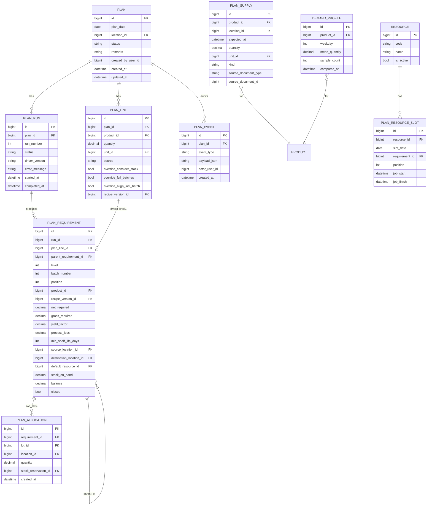

# PLANNING_ERD.md — Chunk 2 (Signed)

**Status:** COMPLETE — awaiting your review  
**Date:** 2026-07-31  
**Folder:** `planning-redesign/chunk-02-erd/`  
**Depends on:** [../chunk-01-requirements/PLANNING_REQUIREMENTS.md](../chunk-01-requirements/PLANNING_REQUIREMENTS.md)

**Rules:** No stored procedures. No planning triggers. All rules in Django services. Schema sized for MVP + deferred tables so Chunks 9–10 do not force painful migrations.

---

## 1. Design principles

| Principle | Choice |
|---|---|
| Table prefix | `plan_*` (except deferred `resource`, `demand_profile`) |
| IDs | `BIGINT` autoincrement PKs |
| Quantities | `DECIMAL(16,6)` (match stock_ledger) |
| External masters | Django `ForeignKey` to `product`, `recipe_version`, `loc_location`, `stock_lot`, `stock_reservation` where integrity helps; **business logic still only via adapters** |
| Explosion history | Immutable `plan_run` — never UPDATE requirement rows of a prior run |
| Soft → hard stock | `plan_allocation.stock_reservation_id` null until commit |
| Future supply | `plan_supply` (ledger cannot hold future effective_at) |
| Concurrency | App uses `SELECT … FOR UPDATE` on `plan` during explode/commit — no DB trigger |

---

## 2. ERD (MVP + deferred)



External (existing): `product`, `product_unit`, `recipe_version`, `loc_location`, `stock_lot`, `stock_reservation`.

---

## 3. MVP tables — column dictionary

### 3.1 `plan` — db_table `plan`

| Column | Type | Null | Notes |
|---|---|---|---|
| `id` | BIGINT PK | N | |
| `plan_date` | DATE | N | Production day |
| `location_id` | BIGINT FK → `loc_location.id` | N | Department / plan owning location |
| `status` | VARCHAR(16) | N | `draft` \| `locked` \| `closed` |
| `remarks` | TEXT | Y | |
| `created_by_user_id` | BIGINT | Y | Cognito/app user id; no FK until users_rbac models exist |
| `created_at` | DATETIME(6) | N | |
| `updated_at` | DATETIME(6) | N | |

**Constraints / indexes**

- `UNIQUE (plan_date, location_id)` → `uq_plan_date_location`
- `CHECK (status IN ('draft','locked','closed'))` → `chk_plan_status`
- `INDEX (status, plan_date)` → `idx_plan_status_date`
- `INDEX (location_id, plan_date)` → `idx_plan_location_date`

**Lifecycle**

```
draft --lock--> locked --close--> closed
closed --reopen--> draft
draft --close--> closed   (allowed)
```

- `locked`: no insert/update/delete on `plan_line`
- `closed`: no explode/allocate/commit; releases open allocations + reservations
- `reopen`: status → `draft`; does not delete historical `plan_run` rows

---

### 3.2 `plan_line` — db_table `plan_line`

| Column | Type | Null | Notes |
|---|---|---|---|
| `id` | BIGINT PK | N | |
| `plan_id` | BIGINT FK → `plan.id` ON DELETE CASCADE | N | |
| `product_id` | BIGINT FK → `product.id` | N | Finished good |
| `quantity` | DECIMAL(16,6) | N | Net FG demand qty; `> 0` |
| `unit_id` | BIGINT FK → `product_unit.id` | N | |
| `source` | VARCHAR(16) | N | `manual` \| `order` \| `forecast` (MVP writes `manual`) |
| `override_consider_stock` | BOOLEAN | Y | NULL = use product flag |
| `override_full_batches` | BOOLEAN | Y | NULL = use product flag |
| `override_align_last_batch` | BOOLEAN | Y | NULL = use product flag |
| `recipe_version_id` | BIGINT FK → `recipe_version.id` | Y | Optional pin; else resolve at explode start and store on requirements |
| `sort_order` | INT | N | Default 0 |
| `created_at` | DATETIME(6) | N | |
| `updated_at` | DATETIME(6) | N | |

**Constraints / indexes**

- `CHECK (quantity > 0)` → `chk_plan_line_qty`
- `CHECK (source IN ('manual','order','forecast'))` → `chk_plan_line_source`
- `INDEX (plan_id)` → `idx_plan_line_plan`
- `INDEX (product_id)` → `idx_plan_line_product`
- Optional soft uniqueness: same product may appear more than once (bundles/sources) — **no unique on (plan, product)**

---

### 3.3 `plan_run` — db_table `plan_run`

| Column | Type | Null | Notes |
|---|---|---|---|
| `id` | BIGINT PK | N | |
| `plan_id` | BIGINT FK → `plan.id` ON DELETE CASCADE | N | |
| `run_number` | INT | N | Monotonic per plan; allocated under plan row lock |
| `status` | VARCHAR(16) | N | `running` \| `complete` \| `failed` |
| `driver_version` | VARCHAR(32) | N | Engine version string e.g. `explode-1.0` |
| `error_message` | TEXT | Y | Set when `failed` |
| `started_at` | DATETIME(6) | N | |
| `completed_at` | DATETIME(6) | Y | |

**Constraints / indexes**

- `UNIQUE (plan_id, run_number)` → `uq_plan_run_number`
- `CHECK (status IN ('running','complete','failed'))` → `chk_plan_run_status`
- `INDEX (plan_id, status)` → `idx_plan_run_plan_status`

**Immutability:** after `complete` or `failed`, never mutate child `plan_requirement` rows. New explode = new `plan_run`.

---

### 3.4 `plan_requirement` — db_table `plan_requirement`

| Column | Type | Null | Notes |
|---|---|---|---|
| `id` | BIGINT PK | N | |
| `run_id` | BIGINT FK → `plan_run.id` ON DELETE CASCADE | N | |
| `plan_line_id` | BIGINT FK → `plan_line.id` ON DELETE SET NULL | Y | Set on level-1 rows driven by a line |
| `parent_requirement_id` | BIGINT FK → `plan_requirement.id` ON DELETE CASCADE | Y | NULL = level-1 root |
| `level` | INT | N | 1 = FG from plan line |
| `batch_number` | INT | N | Default 1; children inherit |
| `position` | INT | Y | Resource sequence (Chunk 9); nullable in MVP |
| `product_id` | BIGINT FK → `product.id` | N | |
| `recipe_version_id` | BIGINT FK → `recipe_version.id` | Y | NULL if purchased leaf / no recipe |
| `net_required` | DECIMAL(16,6) | N | After netting |
| `gross_required` | DECIMAL(16,6) | N | After netting / batch policy |
| `yield_factor` | DECIMAL(16,6) | N | Snapshot used in calc |
| `process_loss` | DECIMAL(16,6) | N | Snapshot; must be `> 0` |
| `min_shelf_life_days` | INT | N | Snapshot applied for eligibility |
| `source_location_id` | BIGINT FK → `loc_location.id` | Y | |
| `destination_location_id` | BIGINT FK → `loc_location.id` | Y | |
| `default_resource_id` | BIGINT | Y | Logical FK to `resource.id` (table may be empty until Chunk 9) |
| `stock_on_hand` | DECIMAL(16,6) | N | Eligible on-hand seen at explode; default 0 |
| `balance` | DECIMAL(16,6) | N | Remaining to produce/cover after netting; default 0 |
| `closed` | BOOLEAN | N | Default false |
| `created_at` | DATETIME(6) | N | |

**Constraints / indexes**

- `CHECK (level >= 1)` → `chk_plan_req_level`
- `CHECK (batch_number >= 1)` → `chk_plan_req_batch`
- `CHECK (net_required >= 0 AND gross_required >= 0)` → `chk_plan_req_qty`
- `CHECK (process_loss > 0 AND yield_factor > 0)` → `chk_plan_req_factors`
- `INDEX (run_id, level)` → `idx_plan_req_run_level`
- `INDEX (run_id, product_id)` → `idx_plan_req_run_product`
- `INDEX (run_id, closed)` → `idx_plan_req_run_closed`
- `INDEX (parent_requirement_id)` → `idx_plan_req_parent`

---

### 3.5 `plan_allocation` — db_table `plan_allocation`

| Column | Type | Null | Notes |
|---|---|---|---|
| `id` | BIGINT PK | N | |
| `requirement_id` | BIGINT FK → `plan_requirement.id` ON DELETE CASCADE | N | |
| `lot_id` | BIGINT FK → `stock_lot.id` | N | |
| `location_id` | BIGINT FK → `loc_location.id` | N | |
| `quantity` | DECIMAL(16,6) | N | `> 0` |
| `stock_reservation_id` | BIGINT FK → `stock_reservation.id` ON DELETE SET NULL | Y | Null until commit |
| `created_at` | DATETIME(6) | N | |
| `updated_at` | DATETIME(6) | N | |

**Constraints / indexes**

- `CHECK (quantity > 0)` → `chk_plan_alloc_qty`
- `UNIQUE (requirement_id, lot_id, location_id)` → `uq_plan_alloc_req_lot_loc`
- `INDEX (requirement_id)` → `idx_plan_alloc_req`
- `INDEX (stock_reservation_id)` → `idx_plan_alloc_reservation`

**Commit:** create `stock_reservation` with `source_document_type='plan'`, `source_document_id=plan.id`, `source_document_line=requirement.id`; store id here.

---

### 3.6 `plan_supply` — db_table `plan_supply`

| Column | Type | Null | Notes |
|---|---|---|---|
| `id` | BIGINT PK | N | |
| `product_id` | BIGINT FK → `product.id` | N | |
| `location_id` | BIGINT FK → `loc_location.id` | N | |
| `expected_at` | DATETIME(6) | N | Included in ATP when `<= need_by` |
| `quantity` | DECIMAL(16,6) | N | `> 0` |
| `unit_id` | BIGINT FK → `product_unit.id` | N | |
| `kind` | VARCHAR(32) | N | `purchase_order` \| `production_output` \| `opening` \| `manual` |
| `source_document_type` | VARCHAR(24) | Y | e.g. `po`, `plan` |
| `source_document_id` | BIGINT | Y | |
| `remarks` | TEXT | Y | |
| `created_at` | DATETIME(6) | N | |
| `updated_at` | DATETIME(6) | N | |

**Constraints / indexes**

- `CHECK (quantity > 0)` → `chk_plan_supply_qty`
- `CHECK (kind IN (...))` → `chk_plan_supply_kind`
- `INDEX (product_id, location_id, expected_at)` → `idx_plan_supply_atp`
- `INDEX (source_document_type, source_document_id)` → `idx_plan_supply_doc`

Not plan-scoped: supply is global projected inbound used by any plan’s netting.

---

### 3.7 `plan_event` — db_table `plan_event` (audit)

| Column | Type | Null | Notes |
|---|---|---|---|
| `id` | BIGINT PK | N | |
| `plan_id` | BIGINT FK → `plan.id` ON DELETE CASCADE | N | |
| `event_type` | VARCHAR(64) | N | e.g. `created`, `locked`, `unlocked`, `closed`, `reopened`, `run_started`, `run_complete`, `run_failed`, `committed`, `rolled_over` |
| `payload_json` | JSON | Y | |
| `actor_user_id` | BIGINT | Y | |
| `created_at` | DATETIME(6) | N | |

**Indexes:** `INDEX (plan_id, created_at)` → `idx_plan_event_plan_time`

---

## 4. Deferred tables (create empty in Chunk 5 schema — unused until 9/10)

### 4.1 `demand_profile` — Chunk 10

| Column | Type | Null | Notes |
|---|---|---|---|
| `id` | BIGINT PK | N | |
| `product_id` | BIGINT FK → `product.id` | N | |
| `weekday` | TINYINT | N | 0=Mon … 6=Sun |
| `mean_quantity` | DECIMAL(16,6) | N | |
| `sample_count` | INT | N | |
| `computed_at` | DATETIME(6) | N | |

- `UNIQUE (product_id, weekday)` → `uq_demand_profile_product_weekday`

### 4.2 `resource` — Chunk 9

| Column | Type | Null | Notes |
|---|---|---|---|
| `id` | BIGINT PK | N | |
| `code` | VARCHAR(64) | N | Unique |
| `name` | VARCHAR(255) | N | |
| `is_active` | BOOLEAN | N | Default true |
| `created_at` | DATETIME(6) | N | |

### 4.3 `plan_resource_slot` — Chunk 9

| Column | Type | Null | Notes |
|---|---|---|---|
| `id` | BIGINT PK | N | |
| `resource_id` | BIGINT FK → `resource.id` | N | |
| `slot_date` | DATE | N | |
| `requirement_id` | BIGINT FK → `plan_requirement.id` | N | |
| `position` | INT | N | Sequence on resource/day |
| `job_start` | DATETIME(6) | Y | |
| `job_finish` | DATETIME(6) | Y | |

- `UNIQUE (resource_id, slot_date, position)` → `uq_plan_resource_slot_pos`
- `UNIQUE (requirement_id)` → one slot per requirement when scheduled

**Not in schema:** legacy `jobList` text, MEMORY scratch, schedule global/local stubs until finite-capacity epic.

---

## 5. Lifecycle & concurrency (data rules)

| Action | Precondition | DB effects |
|---|---|---|
| Create plan | Unique date+location | Insert `plan` + `plan_event` |
| Edit lines | `status=draft` | CRUD `plan_line` |
| Lock | `draft` | `status=locked` |
| Explode | `draft` or `locked` | Lock plan row; insert `plan_run` (`running`); write requirements; mark `complete`/`failed` |
| Soft allocate | Latest complete run; plan not closed | Insert/update `plan_allocation` (`stock_reservation_id` null) |
| Commit | Soft allocs exist | Create `stock_reservation`; set FK; event `committed` |
| Close | `draft` or `locked` | Release open reservations + clear soft allocs or mark released; `status=closed`; close open requirements |
| Reopen | `closed` | `status=draft`; event `reopened` |
| Age + rollover | Command | Close aged plan; copy unfinished open lines to next plan (D2) |

---

## 6. Legacy → new map

| Legacy | New | Notes |
|---|---|---|
| `tblplanmaster` | `plan` | status enum replaces dual `-1` flags |
| `tblplanmasterdetails` | `plan_line` | |
| `tblBOMaggregate` (+ MEMORY) | `plan_requirement` + `plan_run` | No global scratch |
| `tblplanmasterdetailsStockAllocations` | `plan_allocation` → `stock_reservation` | |
| `tblplanmasterbom*` | — | Dropped; covered by requirements |
| `tblplanmasterlogtrail` | `plan_event` | |
| `tblplanmasterItemBundles*` | — | Out of MVP |
| Trends / projected plan* | `demand_profile` (+ later views) | Empty until Chunk 10 |
| `tblResources` | `resource` | Empty until Chunk 9 |
| `tblplanresource*` / queues | `plan_resource_slot` | No jobList |
| `tblResourcesSchedule*` | — | Finite capacity epic later |

---

## 7. Explicit non-goals in this ERD

- No MySQL EVENT / SP / planning trigger definitions  
- No denormalised display columns on transaction rows  
- No per-user scratch tables  
- No finite-capacity calendar tables  
- No picking-list tables (post-MVP)

---

## 8. Chunk 5 implementation note

When coding (later): Django app `planning` in `svc-locations-django`; one migration creating **all** tables in §§3–4 (deferred empty). Services ignore deferred tables until Chunks 9–10.

---

## 9. Sign-off checklist

- [x] MVP entities fully column-specified  
- [x] Indexes + CHECKs + uniques listed  
- [x] Lifecycle + concurrency rules stated  
- [x] Deferred tables reserved without blocking MVP  
- [x] No SP/trigger dependency  
- [ ] **Your approve** → unlocks Chunk 3 (`PLANNING_API.md`)

**Chunk 2 complete.** Next: approve **Chunk 3** for API contracts.
