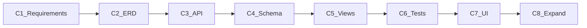

# Production Register — Chunk List

Work **one chunk at a time**. Approve → artifact → stop.

| Chunk | Name | Type | Deliverable | Status |
|------:|------|------|-------------|--------|
| **1** | Legacy map + requirements | Design | [chunk-01-requirements/PRODUCTION_REGISTER_REQUIREMENTS.md](chunk-01-requirements/PRODUCTION_REGISTER_REQUIREMENTS.md) | **APPROVED** |
| **2** | ERD | Design | [chunk-02-erd/PRODUCTION_REGISTER_ERD.md](chunk-02-erd/PRODUCTION_REGISTER_ERD.md) | **APPROVED** |
| **3** | API contracts | Design | [chunk-03-api/PRODUCTION_REGISTER_API.md](chunk-03-api/PRODUCTION_REGISTER_API.md) | **APPROVED** |
| **4** | Django schema | Code | [chunk-04-django-schema/NOTES.md](chunk-04-django-schema/NOTES.md) + `production_register/` | **APPROVED** |
| **5** | Views + HTTP | Code | [chunk-05-http/NOTES.md](chunk-05-http/NOTES.md) + `views.py` | **APPROVED** |
| **6** | Contract tests | Code | [chunk-06-tests/NOTES.md](chunk-06-tests/NOTES.md) + `tests.py` | **APPROVED** |
| **7** | Tablet UI | Code | [chunk-07-ui/NOTES.md](chunk-07-ui/NOTES.md) + `gazeboo-cloud-web` | **APPROVED** |
| **8** | Internal Process + Warehouse + cutover | Code | [chunk-08-cutover/NOTES.md](chunk-08-cutover/NOTES.md) | **APPROVED** |

**Rules:** no `services.py`; logic in `views.py`; no legacy SP `callproc`; stock via `stock_ledger.production()`.
