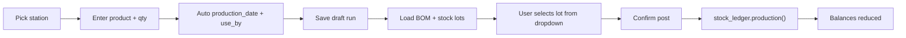

# PRODUCTION_REGISTER_REQUIREMENTS.md — Chunk 1

**Status:** APPROVED  
**Date:** 2026-08-03  
**Branch:** `production_register`  
**Sources:** MySQL dump `vb-access-legacy/data/Dump20260720.sql`, Access forms/containers, Oct-2025 tablet (`Legacy-mordern-effort-october-2025`), modern apps in `svc-locations-django`

**Method:** Map legacy *intent* for floor MADE/CONSUME. Do **not** port SP signatures or call legacy procs. Logic lives in `production_register/views.py`.

---

## 0. Headline findings

| Finding | Evidence | Implication |
|---|---|---|
| No separate production table | Floor UI writes `tblstockmovement` with `PROD*` / `STK*` actions | New `prod_reg_run` is UX/domain header; stock SoT = `stock_ledger` |
| MADE = `stkin`, CONSUME = child `stkout` + `source` | Audit trail + SPs | One post → `stock_ledger.production(output + inputs)` |
| Stock cache rebuilt by formula | `fnSTKitemStockAllAttributes` | Use `StockBalance` / ATP; never reimplement SUM(in-out) in this app |
| SP signature drift broke tablet | `procSTKinternalProcessUSAGE` + trailing `0`; HR unpatched | Zero `callproc` forever |
| Warehouse ≠ production register | Cold Storage / freezers = `storage=-1` + transfers | Warehouse UX uses `/stock/transfer/` |
| Use-by was manual / form-driven | Access fields + product shelf-life flags | Auto-calc from `ProductShelfLife` + location modifiers |

---

## 1. Scope

### 1.1 In scope (Phase 1)

| Area | Legacy | Modern |
|---|---|---|
| High Risk packing register | `frmqrySRCproductionData-HRSK`, `PRODHIGHRISK` | Station `high_risk` |
| Sleeving register | `frmqrySRCproductionData-SLVG`, `PRODSLEEVING` | Station `sleeving` |
| Record qty made | `stkin` | `prod_reg_run` + `production_output` |
| Record BOM used with live stock | `procSTKstockOUTprocess` + USAGE | BOM lines + **lot dropdown from balances** → `production_consumption` |
| Auto use-by / production date | form fields + product flags | Calc in create/preview views |
| Downtime / DAY START | downtime item rows | `prod_reg_downtime` (no stock) |
| Void | soft `livetransaction=0` | `void` + `stock_ledger.reversal` |

### 1.2 Later (same model)

| Area | Notes |
|---|---|
| Internal Process | Cooking, Belts, Fryers, … — same run/consume views, many process locations |
| Warehouse | Transfer UI only; not MADE/CONSUME |
| Plan handoff | Prefill from `/planning/portal/today/` |

### 1.3 Out of scope

| Area | Reason |
|---|---|
| Calling any legacy STK/OPS SP | Fragility lesson |
| `production_register/services.py` | Logic in `views.py` only |
| Rebuilding Access Stocks module | Already `stock_ledger` |
| Offline-first sync | LAN + idempotent retry |

### 1.4 Already owned upstream (consume, do not redefine)

| Domain | App |
|---|---|
| Ledger post / balances / genealogy | `stock_ledger` (`production()`, `StockBalance`, ATP) |
| BOM tree | `recipe` (`RecipeVersion`, `RecipeComponent`) |
| Locations / stations | `locations` (`Location`, `LocationStockProfile`) |
| Shelf life | `product.ProductShelfLife` |
| Published plan lines | `planning` portal |

---

## 2. Floor user journey (happy path)

1. Operator opens **High Risk** or **Sleeving**.
2. Enters product, qty made, resource, shift, start/end.
3. System sets **production_date** (default today) and **use_by** (auto — see §4).
4. Opens **Use** screen: each recipe ingredient shows:
   - needed qty (recipe × made × yield)
   - **dropdown of lots with on-hand qty, use-by, trace** at consume location
5. Operator picks lot(s) + qty used.
6. Confirm → one atomic ledger production post → stock minuses automatically.
7. Short stock: warn; block post unless authorised override (Phase 1: warn + block).

---

## 3. BOM stock picker (core UX rule)

**Requirement R-BOM-1:** Preview response must return, per ingredient:

- `component_product_id`, name, `needed_qty`, `unit_id`
- `lots[]`: `{ lot_id, quantity_on_hand, use_by, production_date, trace/supplier code }` where `quantity_on_hand > 0` at consume `location_id`

**R-BOM-2:** User selection is source of truth for which lot is consumed (not silent FEFO auto-pick). FEFO may **sort** dropdown (earliest use-by first) but not auto-commit.

**R-BOM-3:** On post, selected lots → `inputs[]` to `stock_ledger.production()`; balances decrease via existing ledger path.

**R-BOM-4:** Sum of selected qty per ingredient should meet `needed_qty` (warn if under/over; Phase 1 block under).

**R-BOM-5 — Recipe version (non-negotiable):** BOM lines always come from **one pinned `recipe_version_id` on the run**, resolved as:

1. If run is linked to a **plan line** (`plan_line_id` set) → use that plan line’s `recipe_version_id` (the version the plan was exploded/made with).
2. Else → use the product’s **latest ACTIVE** recipe version (same resolve rule as `planning.adapters.recipe.resolve_recipe_version_id`).

Store `recipe_version_id` on `prod_reg_run` at create time so preview/post never silently switch versions mid-run. Response always echoes `recipe_version_id` + version number.

---

## 4. Auto production_date + use_by

| Rule | Behaviour |
|---|---|
| R-UB-1 | Default `production_date` = run date (today / shift date) |
| R-UB-2 | Default `use_by` = `production_date + ProductShelfLife.shelf_life_days` |
| R-UB-3 | Apply location `LocationStockProfile.use_by_modifier` (days offset) when set |
| R-UB-4 | If `force_use_by` / `force_production_date` on product: require explicit client values (no silent blank) |
| R-UB-5 | If location `extends_component_use_by`: after lot picks, clamp output `use_by` to **min(component lot use_bys)** when that is earlier |
| R-UB-6 | Preview/create responses always return computed defaults so tablet can show them |

---

## 5. SP → views.py map (no services package)

| Legacy | View responsibility | Calls |
|---|---|---|
| `procSTKinternalProcessIN` | `create_run` / POST `/production/runs/` | ORM `prod_reg_run`; shelf-life calc |
| `procSTKstockOUTprocess` | `preview_consume` / GET|POST preview | recipe + `StockBalance` / ATP |
| `procSTKinternalProcessUSAGE` | part of `post_run` | `stock_ledger.production()` |
| DELETE blocked | `void_run` | `stock_ledger.reversal` |
| DAY START | downtime endpoints | no ledger |

**Hard rules**

- No `CALL` / `callproc`
- No `production_register/services.py`
- Idempotency key required on post
- Access `-1` flags become Python `True`/`False` / status enums

---

## 6. Data owned by this app

| Table | Purpose |
|---|---|
| `prod_reg_station` | Station type ↔ location mapping |
| `prod_reg_run` | Floor MADE header (status draft/posted/void) |
| `prod_reg_run_consumption` | Selected ingredient lot + qty (+ ledger entry id after post) |
| `prod_reg_downtime` | Non-stock downtime rows |

Ledger tables stay in `stock_ledger` only.

---

## 7. Acceptance criteria (Chunk 1 sign-off)

- [x] Scope Phase 1 = High Risk + Sleeving only
- [x] BOM dropdown shows live ingredient stock; user picks lots; post minuses stock
- [x] BOM from plan’s recipe version when linked, else latest ACTIVE recipe (R-BOM-5)
- [x] Auto use-by rules §4 accepted
- [x] No services layer; views.py owns logic
- [x] No legacy SP coupling
- [x] Ready for Chunk 2 ERD

---

## 8. Open items for later chunks (not blocking Chunk 1)

- Exact auth header (reuse stock `X-API-Token` vs Cognito claims)
- Multi-lot split UI per single ingredient
- Authorised negative / short override
- Plan-line link on run
