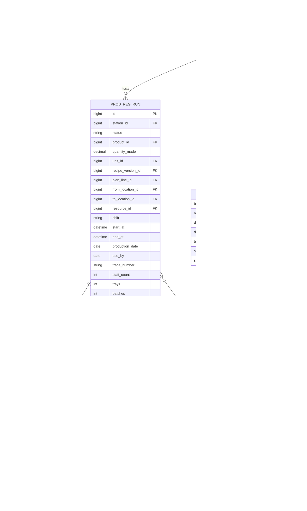
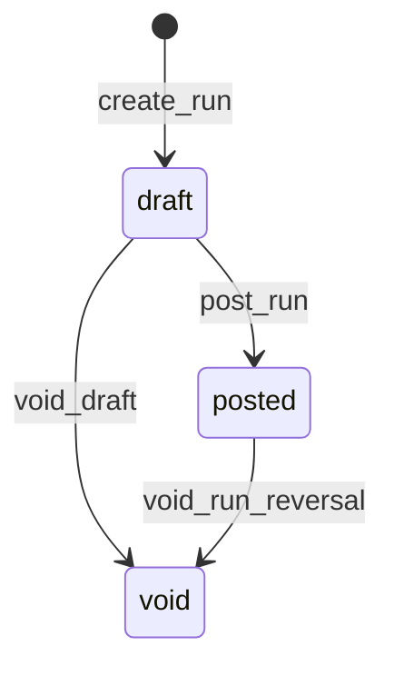

# PRODUCTION_REGISTER_ERD.md — Chunk 2

**Status:** APPROVED  
**Date:** 2026-08-03  
**Depends on:** [../chunk-01-requirements/PRODUCTION_REGISTER_REQUIREMENTS.md](../chunk-01-requirements/PRODUCTION_REGISTER_REQUIREMENTS.md)

**Rules:** No stored procedures. No triggers in this app. Logic in `views.py`. Ledger writes only via `stock_ledger.production()` / `reversal()`.

---

## 1. Design principles

| Principle | Choice |
|---|---|
| Table prefix | `prod_reg_*` |
| IDs | `BIGINT` / AutoField PKs |
| Quantities | `DECIMAL(16,6)` (match stock_ledger) |
| Recipe pin | `prod_reg_run.recipe_version_id` set at create — BOM never drifts |
| Plan link | Optional `plan_line_id` — when set, recipe version **must** match that line’s version |
| Stock SoT | FK to `stock_entry` / `stock_lot` after post; no qty cache in this app |
| Void | Status flip + ledger reversal; never hard-delete posted rows |

---

## 2. ERD



---

## 3. Table specs

### 3.1 `prod_reg_station`

| Column | Type | Notes |
|---|---|---|
| `id` | PK | |
| `code` | VARCHAR(32) UNIQUE | `high_risk`, `sleeving`, `internal_process`, `warehouse` |
| `name` | VARCHAR(64) | Display |
| `location_id` | FK → `loc_location` | Primary floor location |
| `default_output_location_id` | FK → `loc_location` | Where MADE stock lands (dest) |
| `default_consume_location_id` | FK → `loc_location` | Where BOM lots are drawn (often same as location) |
| `is_active` | BOOL | |

Phase 1 seed: `high_risk`, `sleeving`.

### 3.2 `prod_reg_run`

| Column | Type | Notes |
|---|---|---|
| `id` | PK | |
| `station_id` | FK | |
| `status` | VARCHAR(16) | `draft` \| `posted` \| `void` |
| `product_id` | FK → product | Output product |
| `quantity_made` | DECIMAL(16,6) | > 0 |
| `unit_id` | FK → unit | |
| `recipe_version_id` | FK → `recipe_version` | **Pinned** — R-BOM-5 |
| `plan_line_id` | FK → `plan_line` NULL | When set, recipe version = that line’s version |
| `from_location_id` | FK location | Src (station floor) |
| `to_location_id` | FK location | Dest (output lands here) |
| `resource_id` | FK → `resource` NULL | Planning resource |
| `shift` | VARCHAR(32) NULL | |
| `start_at` / `end_at` | DATETIME | start < end (unless downtime elsewhere) |
| `production_date` | DATE | Auto default |
| `use_by` | DATE | Auto calc |
| `trace_number` | VARCHAR(64) NULL | |
| `staff_count` / `trays` / `batches` | INT NULL | Floor ops fields |
| `idempotency_key` | VARCHAR(64) UNIQUE | Required before/at post |
| `output_stock_entry_id` | FK → `stock_entry` NULL | Set on post |
| `actor_user_id` | INT NULL | |
| `created_at` / `posted_at` / `voided_at` | DATETIME | |

**Constraints**

- `chk_prod_reg_run_status` ∈ draft/posted/void
- `chk_prod_reg_run_qty` quantity_made > 0
- `uq_prod_reg_run_idempotency` unique idempotency_key (nullable until post — or require on create)

**Recipe resolve at create (views.py)**

```
if plan_line_id:
  recipe_version_id = plan_line.recipe_version_id  # must exist
else:
  recipe_version_id = latest ACTIVE for product  # order_by -version_number
```

### 3.3 `prod_reg_run_consumption`

| Column | Type | Notes |
|---|---|---|
| `id` | PK | |
| `run_id` | FK CASCADE | |
| `component_product_id` | FK product | From pinned recipe components |
| `lot_id` | FK → `stock_lot` | User dropdown pick |
| `quantity` | DECIMAL(16,6) | > 0 used |
| `unit_id` | FK unit | |
| `needed_qty` | DECIMAL(16,6) | Snapshot of suggested need |
| `stock_entry_id` | FK → `stock_entry` NULL | Set on post |

Allow multiple rows per component (multi-lot split).

### 3.4 `prod_reg_downtime`

Non-stock. No ledger link. Station + times + optional resource/shift/remarks.

---

## 4. External relationships (not owned here)

| External | Use |
|---|---|
| `recipe_version` + `recipe_component` | BOM lines for pinned version |
| `plan_line.recipe_version_id` | Source when run from plan |
| `stock_lot` / `stock_balance` | Dropdown options at `default_consume_location_id` |
| `stock_entry` | Output + consumption after `production()` |
| `stock_genealogy` | Created inside `stock_ledger.production()` |
| `resource` | Optional machine/line |
| `product_shelf_life` / `loc_stock_profile` | Auto use-by |

---

## 5. Status machine



- `draft`: editable make fields + consumption picks; no ledger
- `posted`: immutable; ledger entries set
- `void`: terminal; if was posted, reversals exist

---

## 6. Acceptance criteria (Chunk 2)

- [x] Tables cover station / run / consumption / downtime
- [x] `recipe_version_id` required on run; plan_line path documented
- [x] Consumption rows hold user-selected `lot_id`
- [x] Ledger FKs nullable until post
- [x] Ready for Chunk 3 API contracts
